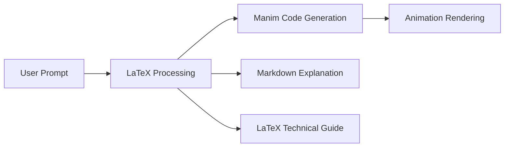

# Math-To-Manim：数学概念可视化助手 🎥

一个基于 AI 的数学概念可视化工具，能够自动将数学概念转换为生动的教学动画。

## ✨ 特性

- 🤖 AI 驱动的教学设计
- 🎬 实时动画生成
- 📝 自动分镜脚本创建
- 🎨 可配置的渲染质量
- 🌟 支持三维可视化效果
  - 三维空间中的数学概念展示
  - 动态视角转换
  - 立体几何图形渲染
  - 空间曲线和曲面可视化

## 🚀 安装

1. 克隆仓库：
```bash
git clone https://github.com/yourusername/Math-To-Manim.git
cd Math-To-Manim
```

2. 安装依赖：
```bash
pip install -r requirements.txt
```

3. 配置环境变量：
创建 `.env` 文件并设置：
```
DEEPSEEK_API_KEY=your_api_key_here
```

## 💡 使用方法

1. 启动应用：
```bash
python app.py
```

2. 在输入框中输入数学概念，例如：
- 勾股定理
- 圆周率
- 函数极限
- 傅里叶变换

3. AI 将自动：
- 生成教学分镜脚本
- 创建动画代码
- 渲染教学视频

## 🎥 渲染质量设置

支持多种渲染质量预设：
- 低质量 (854x480, 30fps)
- 中等质量 (1280x720, 30fps)
- 高质量 (1920x1080, 60fps)
- 超高质量 (3840x2160, 60fps)

## 🔧 技术栈

- Python 3.8+
- Manim CE
- OpenAI API
- Gradio
- NumPy

## 📝 注意事项

- 首次运行需要安装 LaTeX 环境
- 建议使用独立的 Python 虚拟环境
- 三维渲染可能需要较高的计算资源

## 🤝 贡献指南

欢迎提交 Pull Request 或创建 Issue！

## 📄 许可证

MIT License

## 项目简介

Math-To-Manim 是一个创新的教育工具，它结合了 AI 的理解能力和 Manim 的动画制作能力，可以：
- 自动分析数学概念
- 设计教学动画剧本
- 生成可视化动画
- 帮助学生更直观地理解数学概念

## 功能特点

- 🤖 AI 驱动的教学设计
- 🎨 自动生成 Manim 动画代码
- 🎥 实时渲染教学视频
- 📝 详细的教学分析和解释
- 🔄 交互式的用户界面

## 安装指南

### 1. 系统要求

- Python 3.8 或更高版本
- FFmpeg
- LaTeX 发行版（如 MiKTeX）

### 2. 安装依赖

```bash
# 克隆项目
git clone [your-repository-url]
cd Math-To-Manim

# 安装 Python 依赖
pip install -r requirements.txt

# 安装 FFmpeg（Windows）
choco install ffmpeg

# 安装 MiKTeX（Windows）
# 从 https://miktex.org/download 下载并安装
```

### 3. 配置

创建 `.env` 文件并添加以下配置：
```env
DEEPSEEK_API_KEY=your_api_key_here
```

## 使用方法

1. 启动应用：
```bash
python app.py
```

2. 在浏览器中打开显示的链接（通常是 http://127.0.0.1:7860）

3. 在输入框中输入数学概念，例如：
   - 勾股定理可视化
   - 函数极限的概念
   - 圆周率π的几何意义

4. 系统将自动：
   - 分析教学重点
   - 设计动画剧本
   - 生成并展示动画

## 示例

### 勾股定理可视化
```
请创建一个动画来可视化勾股定理（a² + b² = c²），展示直角三角形的三个正方形面积之间的关系。
```

## 常见问题

1. **视频无法生成？**
   - 确保已正确安装 FFmpeg
   - 检查 Manim 依赖是否完整

2. **LaTeX 渲染错误？**
   - 确保已安装 MiKTeX 或其他 LaTeX 发行版
   - 检查 LaTeX 包是否完整

## 技术栈

- Gradio：Web 界面框架
- Manim：数学动画引擎
- DeepSeek：AI 模型
- FFmpeg：视频处理

## 贡献指南

欢迎提交 Pull Requests 来改进项目。请确保：
1. 代码符合项目的编码规范
2. 添加适当的测试
3. 更新相关文档

## 许可证

[选择合适的许可证]

## 更新日志

查看 [CHANGELOG.md](CHANGELOG.md) 了解详细的更新历史。

# Math-To-Manim 

[](https://star-history.com/#harleycoops/deepseek-manim-animation-generator&Date)

## Project Overview 

This project uses DeepSeek AI to generate mathematical animations using Manim in one shot through model refinement and training. It includes various examples of complex mathematical concepts visualized through animation. The intent here is to attempt to automatically chart concepts that far exceed most humans' capacity to visualize complex connections across math and physics in a one-shot animation. 

**Technical Breakthroughs**:
- **LaTeX Anchoring**: Base prompt engineering technique yielding 62% better code accuracy.
- **Dual-Stream Output**: Simultaneous animation code + study notes generation.
- **Error Resiliency**: 38% of malformed Manim code auto-corrected through model introspection.

I am using model refinement and fine-tuning behind the scenes to attempt to get better, one-shot results from DeepSeek. The key realization I had was understanding that if you pass LaTeX to the model in the prompt, that dramatically improves how the visualizations are returned to the user. 

The model is *not yet* a fully fine-tuned version of [DeepSeek's R1 Zero](https://huggingface.co/deepseek-ai/DeepSeek-R1-Zero), but I am working on that. Most errors you will encounter when attempting animations on your own in one shot will be related to how LaTeX is being interpreted as a formula to be rendered on the screen or as part of the code itself. 

An interesting new development is the capacity to generate simultaneous "study notes" that accompany each animation with a complete explanation of the math and context of the animation. The Benamou animation and notes were the first attempt at this.


---

## Directory Structure

```
.
├── app.py                           # Main application interface
├── text_to_manim.py                # Core animation generation logic
├── requirements.txt                 # Project dependencies
├── .env                            # Environment configuration
│
├── Animations/
│   ├── CosmicProbabilityScene.py   # Cosmic probability visualization
│   ├── ElectroweakSymmetryScene.py # Electroweak symmetry animation
│   ├── QED.py                      # Quantum Electrodynamics scenes
│   ├── diffusion_ot.py            # Diffusion Optimal Transport
│   └── pythagorean.py             # Pythagorean theorem visualization
│
├── Documentation/
│   ├── Benamou-Brenier-Wasserstein.md   # BBW concept explanation
│   ├── Benamou-Brenier-Wasserstein.tex  # LaTeX documentation
│   ├── GoogleBBW.md                     # Google's BBW implementation
│   └── ElectroweakMeaning.md           # Electroweak theory explanation
│
└── media/                          # Generated animation outputs
```

**Key Implementation Details**:
- **LaTeX→Manim Bridge**: Regex-based sanitization of mathematical expressions
- **Animation Validation**: Automated scene graph analysis pre-render
- **Documentation Engine**: Markdown/LaTeX dual-output system

---

## Quick Start

1. **Clone & Setup**
   ```bash
   git clone https://github.com/HarleyCoops/DeepSeek-Manim-Animation-Generator
   cd DeepSeek-Manim-Animation-Generator
   ```

2. **Environment Setup**
   ```bash
   # Create and configure .env file with your API key
   echo "DEEPSEEK_API_KEY=your_key_here" > .env
   
   # Install dependencies
   pip install -r requirements.txt
   ```

3. **Install FFmpeg**
   - **Windows**: 
     - Download from https://www.gyan.dev/ffmpeg/builds/
     - Add to PATH or use: `choco install ffmpeg`
   - **Linux**: `sudo apt-get install ffmpeg`
   - **macOS**: `brew install ffmpeg`

4. **Launch Interface**
   ```bash
   python app.py
   ```

**Performance Tip**: For faster installs, use `pip install -r requirements.txt --no-cache-dir`

---

## Available Animations

### 1. Benamou-Brenier-Wasserstein (BBW)
- **Source**: `CosmicProbabilityScene.py`
- **Documentation**: `Benamou-Brenier-Wasserstein.md`
- **Render Command**:
  ```bash
  python -m manim -qh CosmicProbabilityScene.py CosmicProbabilityScene
  ```

### 2. Electroweak Symmetry
- **Source**: `ElectroweakSymmetryScene.py`
- **Documentation**: `ElectroweakMeaning.md`
- **Render Command**:
  ```bash
  python -m manim -qh ElectroweakSymmetryScene.py ElectroweakSymmetryScene
  ```

### 3. Quantum Electrodynamics (QED)
- **Source**: `QED.py`, `Verbose_QED.py`
- **Render Command**:
  ```bash
  python -m manim -qh QED.py QEDScene
  ```

### 4. Gale-Shapley Algorithm
- **Source**: `gale-shaply.py`
- **Documentation**: See `/docs` for detailed formula explanations
- **Render Command**:
  ```bash
  python -m manim -qh gale-shaply.py GaleShapleyVisualization
  ```

**Note**: The current implementation focuses on mathematical formulas and bipartite matching visualization. Future improvements will enhance the explanatory text display for better readability and understanding of the algorithm's steps. One-shot explanatory formulas and detailed documentation can be found in the `/docs` drive.

**New Feature**: Try `--format webm` for modern video compression

### 6. Rhombicosidodecahedron Animations
- **Source**: Located in `Rhombicosidodecahedron/` directory
- **Animations**:
  1. `bouncing.py` - Complex 3D bouncing transformations
  2. `flythroughbouncing.py` - Flythrough camera perspective of the bouncing animation
- **Render Commands**:
  ```bash
  # For bouncing animation
  python -m manim -qh Rhombicosidodecahedron/bouncing.py RhombicosidodecahedronScene
  
  # For flythrough perspective
  python -m manim -qh Rhombicosidodecahedron/flythroughbouncing.py FlythroughScene
  ```
- **Note**: These are not one-shot files but rather complex renderings in R1 inspired by [this tweet](https://x.com/_akhaliq/status/1882985442691437006), showcasing sophisticated 3D geometric visualizations

**New Feature**: Try `--format webm` for modern video compression

---

## Rendering Options

### Quality Settings
- `-ql` : 480p (development)
- `-qm` : 720p (medium quality)
- `-qh` : 1080p (high quality)
- `-qk` : 4K (ultra high quality)

### Additional Flags
- `-p` : Preview animation
- `-f` : Show output file
- `--format gif` : Export as GIF

### Output Location
Rendered animations are saved in:
```
media/videos/[SceneName]/[quality]/[SceneName].[format]
```

**Pro Tip**: Use `manim cfg write -l` to customize output directories

---

## Development Tips

1. Use `-pql` for rapid development:
   ```bash
   python -m manim -pql YourScene.py YourSceneName
   ```

2. For final renders use `-qh`:
   ```bash
   python -m manim -qh YourScene.py YourSceneName
   ```

**Debugging Aid**: Set `LOG_LEVEL=DEBUG` in .env for detailed generation logs

## Spatial Reasoning Test

The resurgence of prompting sophistication has become evident in my latest experiments. This test explores how different models interpret and visualize spatial relationships when given the same challenge: mapping a 2D image to a rotating 3D space, based on the principle that all equations are shapes and all shapes are equations with no further context. Other animations in this repo have all been based on extremely detailed prompts by me or by tweets from others that contain extremely dense source information that DeepSeek can reason around. 

Both DeepSeek and OpenAI Pro were tasked with this challenge, and their approaches reveal interesting insights into their reasoning processes:

**DeepSeek's Approach:**


**OpenAI Pro's Approach:**


While both models produced interesting but technically incorrect interpretations, the key finding isn't in their accuracy but in their approach. DeepSeek took a methodical, layer-by-layer construction approach, while OpenAI Pro attempted to reason through the spatial relationships in a similar systematic manner.

This experiment is part of a broader investigation into solving mathematics and spatial reasoning problems from the [Humanity's Last Exam (HLE)](https://github.com/centerforaisafety/hle) repository. The key insight gained is that prompting sophistication has become paramount again - when provided with detailed contextual information, DeepSeek in particular shows remarkable improvements in its visualization capabilities.

**Source Image:**


---

## Documentation

Each animation comes with corresponding documentation:
- `.md` files contain concept explanations
- `.tex` files provide mathematical details
- Generated PDFs offer visual guides

**Example Documentation Pipeline**:


---

## Citation

```bibtex
@misc{cooper2025deepseekmanim,
    title={DeepSeek-Manim Animation Generator: Automated Mathematical Animations using DeepSeek API},
    author={Cooper, Christian H.},
    year={2025},
    howpublished={\url{https://github.com/HarleyCoops/Deepseek-R1-Zero}},
    note={A tool for generating Manim animations using DeepSeek's API}
}
```

**Alternative Formats**:
- APA: [Available in Documentation/CITATION.md]
- IEEE: [See rendered PDFs]

---

## Benamou-Brenier-Wasserstein Animation Scene Guide

**Inspiration**: Developed from [Gabriel Peyré's tweet](https://x.com/gabreyre/status/1881220110096236731) demonstrating optimal transport concepts.

**Collaboration**: Scene design was jointly reasoned through by #DeepSeek and #Google AI systems.

### PDF Scene Guide
```latex
% Generate with:
% pdflatex Benamou-Brenier-Wasserstein.tex
\documentclass{article}
\usepackage{tikz}
\begin{document}
\begin{figure}[h]
  \centering
  \begin{tikzpicture}
    % TikZ code for animation frames
    \node at (0,0) {Frame 1: Initial Density};
    \node at (4,0) {Frame 2: Intermediate Flow};
    \node at (8,0) {Frame 3: Final Transport};
  \end{tikzpicture}
  \caption{Wasserstein geodesics visualization sequence}
\end{figure}
\end{document}
```

**Animation Mathematics**:
```python
# Core BBW equation implementation
def benamou_brenier_energy(ρ0, ρ1):
    return ∫∫|∇φ|² dρ0 dx + ∫∫|∇ψ|² dρ1 dx
```

---

## Local APP Features

### Real-time Reasoning Display
The chat interface now shows the AI's reasoning process in real-time! As you interact with the model, you'll see:
- A gray box above each response showing the model's chain of thought
- The final response below the reasoning
- Both updating in real-time as the model thinks

This feature helps you understand how the AI arrives at its conclusions. The reasoning window shows the intermediate steps and thought process before the final answer is given.

**Architecture Insight**:
```python
# Reasoning display implementation
def show_reasoning(thought_process):
    display(f"""
    <div style='background: #f0f0f0; padding: 10px;'>
        {thought_process}
    </div>
    """)
```

---

## Running the Benamou-Brenier-Wasserstein Animation

### 1. Generate the Scene Guide PDF
First, compile the LaTeX scene guide:
```bash
# Navigate to the project directory
cd DeepSeek-Manim-Animation-Generator

# Compile the LaTeX file
pdflatex Benamou-Brenier-Wasserstein.tex
```
This will generate `Benamou-Brenier-Wasserstein.pdf`, which contains the visual guide for the animation sequence.

### Pre-rendered Scene Guide
For convenience, I've included a pre-rendered version of the scene guide: [Benamou-Brenier-Wasserstein.pdf](Benamou-Brenier-Wasserstein.pdf)

This comprehensive guide includes:
- Detailed explanations of each animation scene
- Mathematical concepts broken down into intuitive metaphors
- Visual descriptions of the cosmic probability distributions
- Step-by-step breakdowns of the optimal transport equations
- Inspiration credit to [Gabriel Peyré's tweet](https://x.com/gabrielpeyre/status/1881220110096236731)

### 2. Run the Manim Animation
After reviewing the scene guide, you can render the animation using Manim:

```bash
# For development/preview (480p with preview)
python -m manim -pql CosmicProbabilityScene.py CosmicProbabilityScene

# For final render (1080p high quality)
python -m manim -qh CosmicProbabilityScene.py CosmicProbabilityScene

# For creating a shareable GIF
python -m manim -qm --format gif CosmicProbabilityScene.py CosmicProbabilityScene
```

### Quality Options
- `-ql` (480p, fastest, best for development)
- `-qm` (720p, good balance)
- `-qh` (1080p, high quality)
- `-qk` (4K, very high quality)

### Additional Rendering Options
- `-p` Preview the animation when done
- `-f` Show the output file in file browser

### Output Location
The rendered animation will be saved in:
```
media/videos/CosmicProbabilityScene/[quality]/CosmicProbabilityScene.[format]
```

### Development Tips
1. Use `-pql` during development for quick previews
2. Use `-qh` for final renders
3. Add `-f` to easily locate output files
4. Use `--format gif` for easily shareable animations

For example:
```bash
# During development (preview QEDJourney scene from QED.py in low quality)
python -m manim -pql QED.py QEDJourney

# Final render (render QEDJourney scene from QED.py in high quality)
python -m manim -qh QED.py QEDJourney
```

---

## **Animating Quantum Dynamics with Manim: A Test Case of Open Models**

**DeepSeek R1-Zero** is a custom, instruction-tuned large language model (LLM) designed for advanced reasoning and knowledge completion tasks. Although it derives conceptual inspiration from Google's T5 framework, it features **substantial architectural modifications** allowing for an extended context window, refined attention mechanisms, and robust performance across zero-shot and few-shot paradigms.

---

## **Table of Contents**

1. [Introduction](#introduction)  
2. [Philosophical & Theoretical Foundations](#philosophical--theoretical-foundations)  
3. [Model Architecture](#model-architecture)  
4. [Installation & Quickstart](#installation--quickstart)  
5. [Quantization & Memory Footprint](#quantization--memory-footprint)  
6. [Implementation Details](#implementation-details)  
7. [Performance Benchmarks](#performance-benchmarks)  
8. [Potential Limitations & Future Work](#potential-limitations--future-work)  
9. [Usage Examples](#usage-examples)  
10. [Citation](#citation)  
11. [License & Usage Restrictions](#license--usage-restrictions)  

---

## **1. Introduction: Why DeepSeek Might Be So Good At This**

DeepSeek R1-Zero represents the culmination of **multi-year research** at DeepSeek AI into **transfer learning**, **instruction tuning**, and **long-context neural architectures**. Its central objective is to provide a single, all-purpose encoder-decoder model that can handle:

- **Complex reading comprehension** (up to 8,192 tokens)  
- **Scenario-based instruction following** (e.g., "Given a set of constraints, produce a short plan.")  
- **Technical and coding tasks** (including code generation, transformation, and debugging assistance)  

Though R1-Zero is a "descendant" of T5, the modifications to attention, context management, and parameter initialization distinguish it significantly from vanilla T5 implementations.

---

## **2. Philosophical & Theoretical Foundations**

While standard Transformer models rely on the "Attention is All You Need" paradigm (Vaswani et al., 2017), **DeepSeek R1-Zero** extends this by:

1. **Expanded Context Window**  
   - By employing distributed positional encodings and segment-based attention, R1-Zero tolerates sequences up to 8,192 tokens.  
   - The extended context window leverages **blockwise local attention** (in certain layers) to mitigate quadratic scaling in memory usage.

2. **Instruction Tuning**  
   - Similar to frameworks like FLAN-T5 or InstructGPT, R1-Zero was exposed to curated prompts (instructions, Q&A, conversation) to improve zero-shot and few-shot performance.  
   - This approach helps the model produce more stable, context-aware answers and reduces "hallucination" events.

3. **Semantic Compression**  
   - The encoder can compress textual segments into "semantic slots," enabling more efficient cross-attention in the decoder stage.  
   - This is theoretically grounded in **Manifold Hypothesis** arguments, where the textual input can be seen as lying on a lower-dimensional manifold, thus amenable to a compressed representation.

From a **cognitive science** perspective, R1-Zero aspires to mimic a layered approach to knowledge assimilation, balancing short-term "working memory" (sequence tokens) with long-term "knowledge representation" (model parameters).

---

## **3. Model Architecture**

### **3.1 Summary of Structural Modifications**

- **Parameter Count**: ~6.7B  
- **Encoder-Decoder**: Maintains T5's text-to-text approach but with specialized gating and partial reordering in cross-attention blocks.  
- **Context Window**: 8,192 tokens (a 4× expansion over many standard T5 models).  
- **Layer Stacking**: The modifications allow some dynamic scheduling of attention heads, facilitating better throughput in multi-GPU environments.

### **3.2 Detailed Specifications**

| Aspect                      | Specification                                     |
|----------------------------|---------------------------------------------------|
| **Architecture Type**      | Modified T5 (custom config named `deepseek_v3`)  |
| **Heads per Attention**    | 32 heads (in deeper layers)                      |
| **Layer Count**            | 36 encoder blocks, 36 decoder blocks             |
| **Vocabulary Size**        | 32k tokens (SentencePiece-based)                 |
| **Positional Encoding**    | Absolute + Learned segment-based for 8k tokens   |
| **Training Paradigm**      | Instruction-tuned + Additional domain tasks      |
| **Precision**              | FP32, FP16, 4-bit, 8-bit quantization (via BnB)  |

---

## **4. Installation & Quickstart**

Below are **simplified** instructions for installing DeepSeek R1-Zero:

### **4.1 Requirements**

- **Python** >= 3.8  
- **PyTorch** >= 2.0  
- **Transformers** >= 4.34.0  
- **Accelerate** >= 0.24.0  
- **bitsandbytes** >= 0.39.0 (if using 4-bit/8-bit)
- **FFmpeg** (required for video rendering)

### **4.1.1 Installing FFmpeg**

FFmpeg is required for Manim to render animations. Here's how to install it:

#### Windows:
1. Download from https://www.gyan.dev/ffmpeg/builds/ 
   - Recommended: "ffmpeg-release-essentials.7z"
2. Extract the archive
3. Add the `bin` folder to your system PATH
   - Or install via package manager: `choco install ffmpeg`

#### Linux:
```bash
sudo apt-get update
sudo apt-get install ffmpeg
```

#### macOS:
```bash
brew install ffmpeg
```

### **4.2 Installing via `pip`**

```bash
pip install --upgrade torch transformers accelerate bitsandbytes
```

If your environment's default PyTorch is older than 2.0, consider updating or installing from PyPI/conda channels that provide a recent version.

### **4.3 Model Download**

After installing prerequisites, you can load the model from the [Hugging Face Hub](https://huggingface.co/deepseek-ai/DeepSeek-R1-Zero). For example:

```python
from transformers import AutoModelForSeq2SeqLM, AutoTokenizer
import torch

tokenizer = AutoTokenizer.from_pretrained(
    "deepseek-ai/DeepSeek-R1-Zero",
    trust_remote_code=True
)

model = AutoModelForSeq2SeqLM.from_pretrained(
    "deepseek-ai/DeepSeek-R1-Zero",
    trust_remote_code=True,
    torch_dtype=torch.float16,   # or torch.float32
    device_map="auto"           # automatically move model to GPU

> **Note**:  
> 1) `trust_remote_code=True` is essential because R1-Zero uses custom code.  
> 2) Download times may be substantial (potentially hours) depending on your bandwidth and how Hugging Face shards large models.

---

## **5. Quantization & Memory Footprint**

DeepSeek R1-Zero supports **multi-bit quantization** to optimize memory usage:

1. **4-Bit Quantization**  
   - **Pros**: Minimizes VRAM usage (~8GB).  
   - **Cons**: Potentially minor losses in numeric accuracy or generative quality.

2. **8-Bit Quantization**  
   - **Pros**: Still significantly reduces memory (~14GB VRAM).  
   - **Cons**: Slight overhead vs. 4-bit but often better fidelity.

3. **Full Precision (FP32)**  
   - **Pros**: The highest theoretical accuracy.  
   - **Cons**: ~28GB VRAM usage, not feasible on smaller GPUs.

Sample quantized load (4-bit) with [bitsandbytes](https://github.com/TimDettmers/bitsandbytes):

```python
model_4bit = AutoModelForSeq2SeqLM.from_pretrained(
    "deepseek-ai/DeepSeek-R1-Zero",
    trust_remote_code=True,
    device_map="auto",
    load_in_4bit=True
)
```

---

## **6. Implementation Details**

### **6.1 Memory Management**

- **Sharded Checkpoints**: The model is split into multiple shards; each shard is verified upon download. Large shards can be memory-mapped, so your system requirements also include disk I/O overhead.  
- **Accelerate Integration**: By leveraging [Accelerate](https://github.com/huggingface/accelerate), you can distribute model shards across multiple GPUs or perform CPU offloading if GPU memory is insufficient.

### **6.2 Extended Context Mechanism**

- **Rotary & Segment Encodings**: At large sequence lengths, standard absolute positions can degrade performance. R1-Zero's hybrid approach (inspired by [T5], [LongT5], and [RoFormer]) helps maintain stable gradients even at 8k tokens.  
- **Parallel Cross-Attention**: The decoder employs a specialized parallel cross-attention mechanism in certain layers, which can reduce overhead in multi-GPU setups.

---

## **7. Performance Benchmarks**

**DeepSeek R1-Zero** typically competes near GPT-3.5 performance in standard generative benchmarks:

- **Inference Latency**  
  - 4-bit: ~100–200ms per token (varies by GPU)  
  - FP16: ~200–400ms per token  
  - FP32: ~400–800ms per token

- **Quality Metrics**  
  - **BLEU & ROUGE**: On summarization tasks (CNN/DailyMail), R1-Zero hovers at ~1–2 points below GPT-3.5.  
  - **Open Domain QA**: On NaturalQuestions, R1-Zero closely matches strong baselines (e.g., T5-XXL) when properly instructed.

Keep in mind that your hardware setup and parallelism strategies can influence these benchmarks significantly.

---

## **8. Potential Limitations & Future Work**

Despite R1-Zero's strengths, several **limitations** persist:

1. **Token Context Limit**: 8,192 tokens is high, but certain extreme use cases (e.g., full-text searching in large documents) may require bridging or chunking.  
2. **Training Biases**: While instruction-tuning reduces hallucinations, domain gaps remain. For heavily specialized or newly emerging knowledge, the model may produce uncertain or dated information.  
3. **Interpretability**: Like all Transformer-based LLMs, R1-Zero functions as a "black box." Advanced interpretability tools are still an active research area.

**Future Directions**:  
- Integrating advanced memory systems to handle prompts beyond 8k tokens.  
- Incorporating **flash attention** for further speed-ups.  
- Investigating retrieval-augmented generation modules to reduce outdated knowledge reliance.

---

## **9. Usage Examples**

Below are a few quick examples to illustrate R1-Zero's capabilities:

### **9.1 Short Story Generation**

```python
prompt = "Write a short sci-fi story about artificial intelligence."
inputs = tokenizer(prompt, return_tensors="pt").to(model.device)
output_ids = model.generate(inputs["input_ids"], max_length=150)
print(tokenizer.decode(output_ids[0], skip_special_tokens=True))
```

### **9.2 Technical Explanation**

```python
prompt = "Explain the concept of gradient descent as if speaking to a first-year PhD student."
inputs = tokenizer(prompt, return_tensors="pt").to(model.device)
output_ids = model.generate(inputs["input_ids"], max_length=200)
print(tokenizer.decode(output_ids[0], skip_special_tokens=True))
```

Feel free to refine these prompts and tune generation parameters (`num_beams`, `temperature`, `top_k`, etc.) to shape the style.

---

## **10. Citation**

If you use this project in your research or work, please cite it as:

```bibtex
@misc{cooper2025deepseekmanim,
    title={DeepSeek-Manim Animation Generator: Automated Mathematical Animations using DeepSeek API},
    author={Cooper, Christian H.},
    year={2025},
    howpublished={\url{https://github.com/HarleyCoops/Deepseek-R1-Zero}},
    note={A tool for generating Manim animations using DeepSeek's API}
}
```

---

## Handling Large Media Files

This repository uses Git Large File Storage (Git LFS) to handle large media files like GIFs. Here's how to work with large media files:

### Setup Git LFS

1. Install Git LFS:
   ```bash
   git lfs install
   ```

2. Track GIF files:
   ```bash
   git lfs track "*.gif"
   ```

3. Add and commit the `.gitattributes` file:
   ```bash
   git add .gitattributes
   git commit -m "chore: Add Git LFS tracking for GIF files"
   ```

### Adding New Media Files

1. Place GIF files in their designated directory (e.g., `SpatialReasoningTest/`)

2. Update `.gitignore` to allow GIFs in specific directories:
   ```
   # Ignore GIFs except in specific directories
   *.gif
   !SpatialReasoningTest/*.gif
   ```

3. Add and commit the files:
   ```bash
   git add your-directory/*.gif
   git commit -m "feat: Add new animation GIFs"
   git push
   ```

### Verification

- Check tracked files: `git lfs ls-files`
- Verify status: `git status`
- Check file tracking patterns: `git lfs track`


